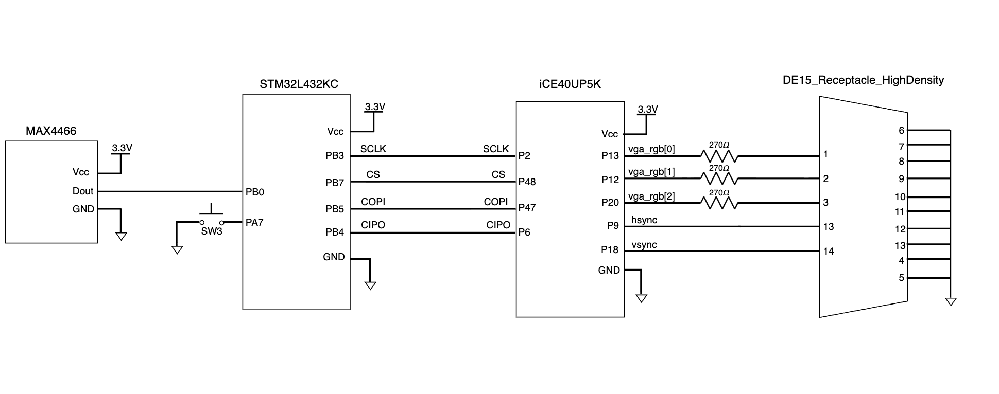

## Schematics
The schematics of the physical system is shown below:

The microphone is connected to the `PB0`, the ADC input pin of the MCU. The MCU is then connected to the FPGA with the SPI outputs, and the FPGA is connected to the VGA using a breakout cord, where sync signals and pixel color signals are then transmitted. The $270 \ohm$ resistors were implemented since each the color pins of the VGA display allows a voltage of 0.7 V. However, our FPGA pins have an output of 3.3 V. By putting a $270 \ohm$ resistor in series with the internal $75 \ohm$ resistor in the VGA, a voltage divider can be created such that the voltage into the VGA is approximately 0.7 V.

## New Hardware

To experiment new hardwares that are not previously used in the class, we chose to implement an analog microphone and a VGA display.

### Analog Microphone

An analog microphone is used to take in sound inputs in our system. The analog microphone, [MAX4466 from Adafruit](https://www.adafruit.com/product/1063#description), should be supplied with a voltage of 2.4 to 5 V. The microphone can detect sound inputs from 20 to 20k Hz and has an adjustable gain of 25x to 125x. Without filtering, the circuit of this microphone is simple enough, with GND, VCC, and OUT, where the VCC is complient with our 3.3 V breakout board. This allows us to use the ADC function in the MCU that was not previously used in the course

### VGA Display

To display the score, we decided to use a VGA display. The VGA display we used was provided by Xavier, and has 1024 * 600 pixels. The refreshing rate of the VGA was chosen to be 60 Hz, such that there are no obvious frame discontinuity for human eye. A [breakout cord](https://www.adafruit.com/product/3125?srsltid=AfmBOorcAtU2xLUsRPJ47qTFsSoTUSsc-L8d0qcTHzdwlLwpBhTWoVgu) was used to send signals between the FPGA and the VGA. More documentations on the design of VGA control can be found in the [FPGA page](fpga.qmd). The VGA allows use to use the primitives, such as `PLL_B` for its clock, which is something new from the previous labs.

## Information and References
Details on the hardware designs of the [MCU](mcu.qmd) and the [FPGA](fpga.qmd) can be found in their respective pages.

The source code for the project are all included in this [Github repository](https://github.com/georgiatai/E155-final-project).

### Hardware References

* MCU - STM32L432KC [[Reference Manual](https://www.st.com/resource/en/reference_manual/rm0394-stm32l41xxx42xxx43xxx44xxx45xxx46xxx-advanced-armbased-32bit-mcus-stmicroelectronics.pdf), [Datasheet](https://www.st.com/resource/en/datasheet/stm32l432kc.pdf), [Programming Manual](https://www.st.com/resource/en/programming_manual/pm0214-stm32-cortexm4-mcus-and-mpus-programming-manual-stmicroelectronics.pdf)]
* FPGA - iCE40UP [[Datasheet](https://www.farnell.com/datasheets/3215488.pdf), [Oscillator User Guide](https://pages.hmc.edu/brake/class/e155/fa23/assets/doc/FPGA-TN-02008-1-7-iCE40-Oscillator-Usage-Guide.pdf)]
* Microphone - MAX4466 [[Description Page](https://www.adafruit.com/product/1063#description), [Datasheet](https://cdn-shop.adafruit.com/datasheets/MAX4465-MAX4469.pdf)]
* VGA Connector [[Description Page](https://www.adafruit.com/product/3125?srsltid=AfmBOorcAtU2xLUsRPJ47qTFsSoTUSsc-L8d0qcTHzdwlLwpBhTWoVgu), [Universal DE-15 Pin assignments](https://www.hattelandtechnology.com/hubfs/pdf/documentation/ind105446-14_rev01.pdf)]
* E155 Breakout Board [[Schematics](https://hmc-e155.github.io/assets/doc/E155%20Development%20Board%20Schematic.pdf), [Adapter Schematics](https://hmc-e155.github.io/assets/doc/E155%20Breadboard%20Adapter%20Schematic.pdf)]

### Other Reference
* G. W. Slade, “The Fast Fourier Transform in Hardware: A Tutorial Based on an FPGA Implementation,” MIT 6.111 Course Handout, Mar. 21, 2013. [Online]. Available: [https://web.mit.edu/6.111/www/f2017/handouts/FFTtutorial121102.pdf](https://web.mit.edu/6.111/www/f2017/handouts/FFTtutorial121102.pdf).

## Bill of Materials

|             Name                    |   Part #  |    Manufacturer    |            Quantity            |                Price                 |
|:-----------------------------------:|:---------:|:------------------:|:------------------------------:|:------------------------------------:|
| Microphone                          | MAX4466   | Adafruit           | x2                             | $6.95 * 2 = $13.90                   |
| Audio Codec                         | MAX98357A | Adafruit           | x1                             | $5.95                                |
| VGA Breakout Cord                   | 3124      | Adafruit           | x1                             | $4.50                                |
| Audio Jack to Micro USB B converter |           | PIIHUSW            | x1                             | $7.57 (with Amazon Prime)            |
| VGA Display                         |           |                    | x1                             | stockroom                            |
| Op-amp                              | MCP601    |                    | x1                             | stockroom                            |
| Potentiometer                       |           |                    | x1                             | stockroom                            |
| Speaker                             |           |                    | x1                             | stockroom                            |
| STM32L432KC Microcontroller         |           | STMicroelectronics | x1                             | E155 teaching team                   |
| UPDuino v3.1 ICE40 UP5K FPGA        |           | tinyVision.ai      | x1                             | E155 teaching team                   |
|                                     |           |                    | Total including shipping + tax | $46.83 (shipping $12.56 & tax $2.35) |
