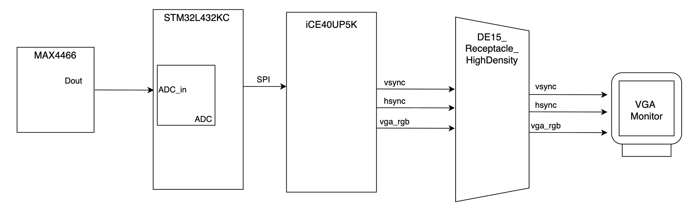

## Project Abstract
This project aims to take in sound inputs — whether from a keyboard, any instrument, or someone singing — transcribe the sound onto a score in real-time at a given BPM, and play back the input melody. An FPGA is used as the main calculation and display engine, using Fast Fourier Transform (FFT) to handle frequency analysis and driving a VGA display. A MCU is used for interfacing the audio inputs.

On the hardware level, an analog microphone takes in sounds, where the MCU converts them into digital signals using ADC and sends the converted signals to the FPGA over SPI. The FPGA then uses FFT to extract the frequency and duration of the note inputted. The array of notes is used by the FPGA to calculate the pixels for displaying the score on a VGA display.

## Project Motivation
Both of us are interested in digital design and audio processing, so we wanted to leverage the FPGA's fast computational capabilities to process sound. Due to the importance and wide applications of the FFT, we wanted to design and integrate FFT in hardware. We chose VGA to display the output because we wanted to accurately depict a music score, which required a higher pixel resolution.

## System Block Diagram

The system block diagram shows the flow of the design, starting with an input from a microphone which is sampled by the MCU's internal ADC. The MCU's ADC output is sent over to the FPGA using SPI. The music score and notes are output from the FPGA to the VGA monitor.

## Note Display

<iframe src="https://drive.google.com/file/d/1m4o0ek6JZH5q7guccxkDqV59gKsoG6BX/preview"
        width="640" height="480" allow="autoplay"></iframe>

Note: The aliasing seen in the video is not on the VGA monitor, but occurs when recording on a phone since the VGA display refreshes at 60Hz and the phone records at a lower frequency.

## Acknowledgements

We would like to thank Prof. Spencer for all his advice in debugging our system and for challenging us to build this complex project. We would also like to thank Xavier for providing the VGA monitors and the grutors Kavi, Troy, and Vikram for their helpful debugging tips.

Lastly, a shoutout to our friends in Microps who accompanied us during late nights in the lab and offered support throughout the process!
