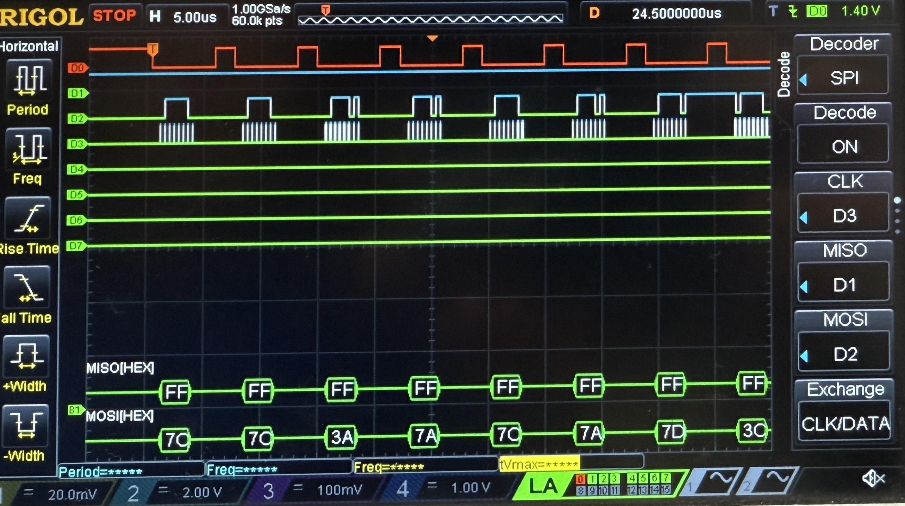
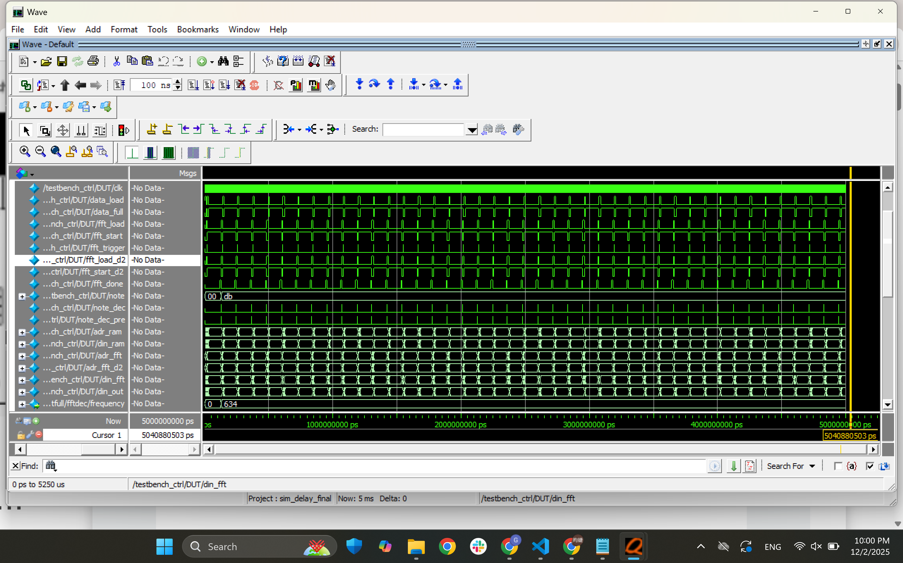

## Project Specifications List

The original proposed specifications are listed here. Note that the playback specs are deleted after consulting Prof. Spencer on downscaling the project.

### Input: detection and analysis
* User can stop and start transcription using physical hardware (e.g. switch/button)
* System converts analog microphone signals into digital
* Uses FFT to extract clear signal from input
* System calculates input frequency and rounds to the nearest half note (e.g. A3#, C4)
* System able to detect duration accurate to 1/16 beat at the given BPM

### Output: display and audio
* Display updates at > 24 Hz
* Note durations are displayed for 120 BPM
* Notes are displayed on VGA monitor ~75 ms after note is released
* ~~Playback audio resembles the input~~
* ~~Playback audio uses an audio codec so that output sound is not square wave~~
* ~~User can control the volume of playback audio~~
* ~~User can control when to playback the transcribed audio (e.g. switch/button), but can only play the audio  when transcription is stopped~~

## Specifications Result

Here, we will explain the specs that are met by the project:

* User can stop and start transcription using physical hardware (e.g. switch/button)

    The system includes a button which signals the MCU to start and stop transcribing.

* System converts analog microphone signals into digital

    The ADC on the MCU worked, and we were able to obtain digital signals from the SPI. A logic analyzer result of the SPI transferring microphone signal is shown here:

    

    The mosi signals mostly sits around `80` because the microphone's quinscient voltage sits at have the voltage supplied.

* Uses FFT to extract clear signal from input

    We were able to use FFT to extract signals and output notes detected. This is especially successful in simulation. In hardware, the system experiences instability due to the amount of environmental noises.

* System calculates input frequency and rounds to the nearest half note (e.g. A3#, C4)

    Building on the previous spec, the FFT was able to clearly distinguish note, octave, and sharp in simulation. In hardware, it was also able to output certain notes.

* System able to detect duration accurate to 1/16 beat at the given BPM

    The constraint of the system had to be changed to 1/2 of the beat due to the downscale of sampling rate.

* Display updates at > 24 Hz

    The VGA is refreshing at a rate of 60 Hz.

* Note durations are displayed for 120 BPM

    Due to the limited memory on our FPGA, we did not have enough memory to store 16 bits and sample at the desired frequency to capture 8th notes at 120BPM. To work with the amount of memory that we had, we decided to lower the resolution of the inputs to 8 bits so that we could calculate whole number k values that correspond to a note in a two octave range.

* Notes are displayed on VGA monitor ~75 ms after note is released

    Only notes that fall under a select magnitude will be processed and displayed. The note magnitude was set in place in order to avoid background noise.

## Testbenches
Before hardware implementation, the top level module of the FFT, `fft_ctrl`, was tested with a testbench which takes a generated ideal bitstream data, and input into the system bit by bit. This simulates the SPI transfer action in real hardward, and as shown in the picture, the FFT was able to produce a a stable note `D5#`, or `db` in with our defined encodings.

Each modules within the FFT, including `fftfull`, `addgen`, etc., are tested by separate testbench too.

## Note Display
<iframe src="https://drive.google.com/file/d/1m4o0ek6JZH5q7guccxkDqV59gKsoG6BX/preview" 
        width="740" height="480" allow="autoplay"></iframe>

Note: The aliasing seen in the video is not on the VGA monitor, but occurs when recording a video on a phone since the VGA display is refreshing at 60Hz and the phone is recording at a lower frequency. 