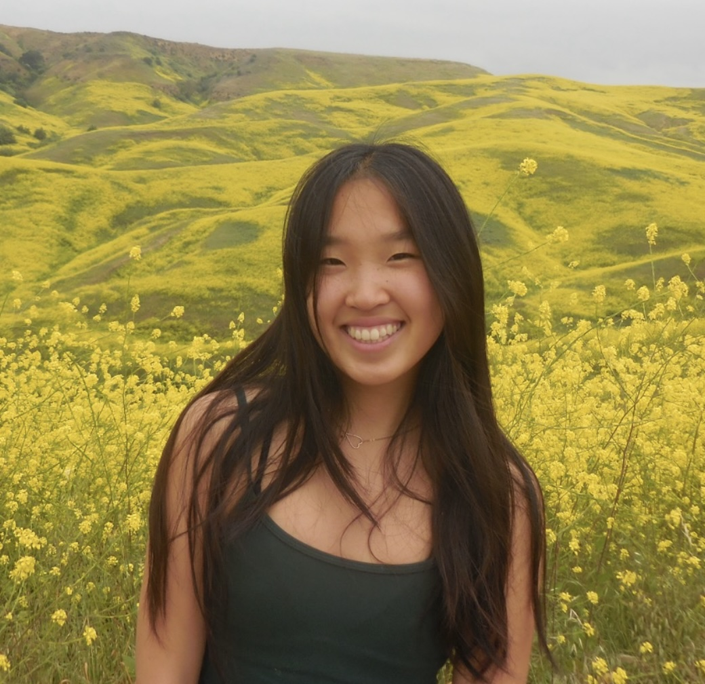
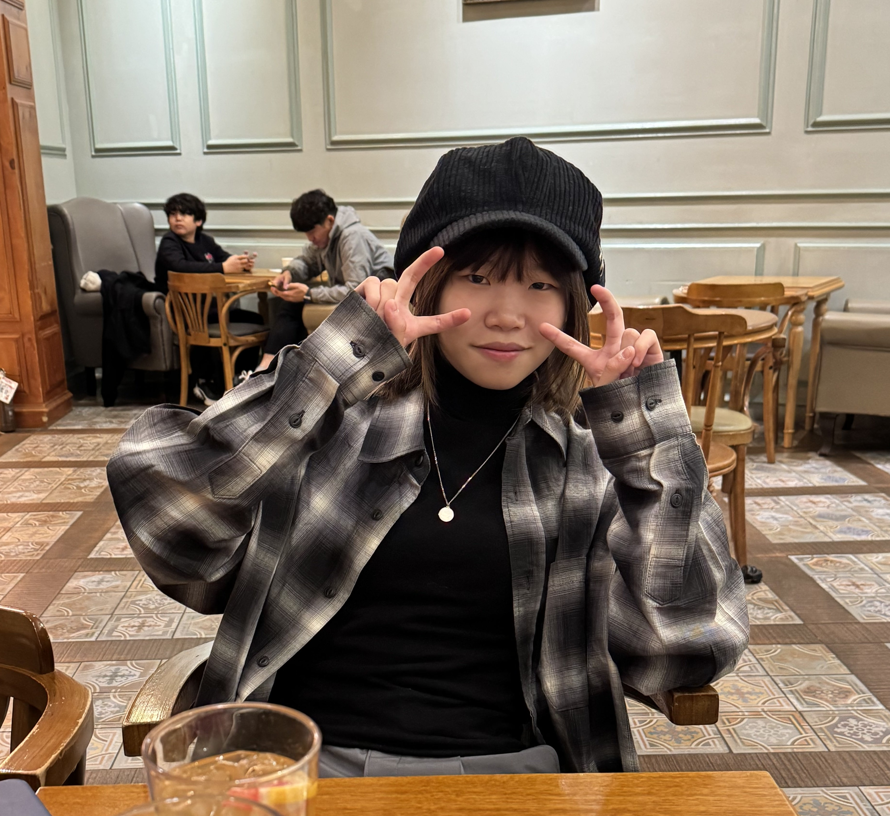

:::: {.team-container}

::: {.team-member}

Julia Gong

{.profile-img}

::: {.social-links}
[LinkedIn](https://www.linkedin.com/in/julia-gong-b8222830a) |
[GitHub](https://github.com/juliacygong)
:::

Julia Gong is a junior engineering major at Harvey Mudd College. She is interested in digital design and the integration of hardware systems. Outside of engineering, she enjoys creative, hands-on work, including pottery, bead embroidery, painting, and knitting.
:::

::: {.team-member}

Georgia Tai

{.profile-img}

::: {.social-links}
[LinkedIn](https://www.linkedin.com/in/georgia-tai/) |
[GitHub](https://github.com/georgiatai)
:::

Georgia Tai is a junior engineering student at Harvey Mudd College with an interest in computer and electrical engineering. Born and raised in Hsinchu, Taiwan, she developed a passion for electrical engineering. Outside of engineering, she enjoys music, drawing, and reading mangas.
:::

::::
